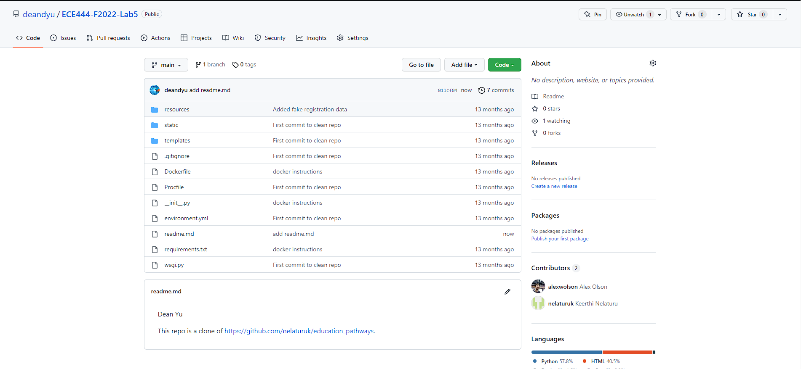
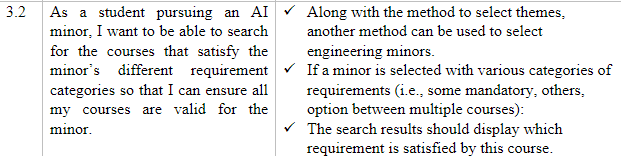

Dean Yu - Valentina Manferrari - Mehak Kalra

This repo is a clone of https://github.com/nelaturuk/education_pathways.

We did Activity 1 - 5 individually and then compared our codes. So we are submitting the repository of a single group member.

**Activity 1**

**Activity 2-5**

Home Page

Results Page - Form

Results Page - Results Table

**Activity 6**

User Story 3.2

User Story 4.1

User Story 6.2

